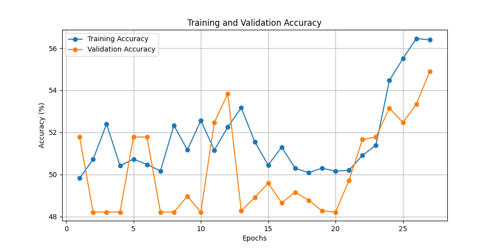
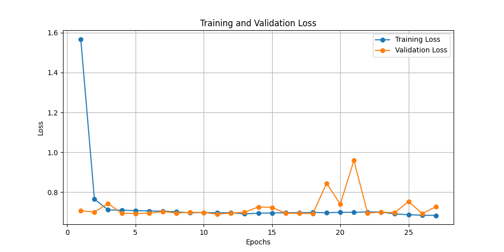

<<<<<<< HEAD

# Convolutional Neural Networks (CNNs)

Convolutional Neural Networks (CNNs) are a type of deep learning architecture specifically designed for image processing and recognition tasks. They use convolutional layers to extract features from images, followed by pooling layers for dimensionality reduction and fully connected layers for classification. CNNs are widely used in applications such as medical image analysis, object detection, and facial recognition.

## Weight Initialization Techniques

Weight initialization is crucial in training deep neural networks as it influences the convergence speed and overall model performance. Common weight initialization techniques include:

- **Random Initialization**: Assigning small random values to weights.
- **Xavier/Glorot Initialization**: Designed for sigmoid/tanh activation functions.
- **He Initialization**: Optimal for ReLU activation, preventing vanishing/exploding gradients.

## Activation Functions

Activation functions introduce non-linearity to neural networks, enabling them to learn complex patterns. Common activation functions include:

- **ReLU (Rectified Linear Unit)**: Most commonly used in CNNs due to efficient gradient propagation.
- **Sigmoid**: Maps values between 0 and 1, mainly used in binary classification.
- **Tanh**: Similar to sigmoid but ranges from -1 to 1, reducing bias shift.

## Optimizers

Optimizers adjust the network's weights to minimize the loss function. Common optimizers include:

- **SGD (Stochastic Gradient Descent)**: Basic optimizer with momentum-based improvements.
- **Adam (Adaptive Moment Estimation)**: Combines momentum and adaptive learning rates for better convergence.
- **RMSprop**: Adapts learning rates based on gradient magnitude, suitable for recurrent networks.

## ResNet (Residual Networks)

ResNet-18 is a deep convolutional network designed to overcome vanishing gradient problems using skip connections (residual learning). It enables training very deep networks without performance degradation, making it highly effective for image classification tasks.

# Experimental Results

## Tabulated Results for Different Configurations

| Configuration | Activation Function | Weight Initialization | Optimizer | Accuracy | Loss |
| ------------- | ------------------- | --------------------- | --------- | -------- | ---- |
| 1             | ReLU                | Xavier                | SGD       | 52.03    | 0.78 |
| 2             | ReLU                | Xavier                | Adam      | 55.34    | 0.69 |
| 3             | ReLU                | Xavier                | RMSprop   | 53.90    | 0.69 |
| 4             | ReLU                | Kaiming               | SGD       | 51.78    | 0.76 |
| 5             | ReLU                | Kaiming               | Adam      | 61.34    | 0.69 |
| 6             | ReLU                | Kaiming               | RMSprop   | 49.78    | 0.69 |
| 7             | ReLU                | Random                | SGD       | 51.78    | 0.70 |
| 8             | ReLU                | Random                | Adam      | 57.62    | 0.69 |
| 9             | ReLU                | Random                | RMSprop   | 49.78    | 0.70 |
| 10            | Sigmoid             | Xavier                | SGD       | 51.78    | 0.70 |
| 11            | Sigmoid             | Xavier                | Adam      | 57.62    | 0.69 |
| 12            | Sigmoid             | Xavier                | RMSprop   | 49.78    | 0.70 |
| 13            | Sigmoid             | Kaiming               | SGD       | 51.78    | 0.70 |
| 14            | Sigmoid             | Kaiming               | Adam      | 57.62    | 0.69 |
| 15            | Sigmoid             | Kaiming               | RMSprop   | 49.78    | 0.70 |
| 16            | Sigmoid             | Random                | SGD       | 51.78    | 0.70 |
| 17            | Sigmoid             | Random                | Adam      | 57.62    | 0.69 |
| 18            | Sigmoid             | Random                | RMSprop   | 49.78    | 0.70 |
| 19            | Tanh                | Xavier                | SGD       | 51.78    | 0.70 |
| 20            | Tanh                | Xavier                | Adam      | 57.62    | 0.69 |
| 21            | Tanh                | Xavier                | RMSprop   | 49.78    | 0.70 |
| 22            | Tanh                | Kaiming               | SGD       | 51.78    | 0.70 |
| 23            | Tanh                | Kaiming               | Adam      | 57.62    | 0.69 |
| 24            | Tanh                | Kaiming               | RMSprop   | 49.78    | 0.70 |
| 25            | Tanh                | Random                | SGD       | 51.78    | 0.70 |
| 26            | Tanh                | Random                | Adam      | 57.62    | 0.69 |
| 27            | Tanh                | Random                | RMSprop   | 49.78    | 0.70 |

**Best-Performing Model**: Based on accuracy and loss, the best configuration consists of the ReLU activation function, Kaiming weight initialization, and the Adam optimizer.

# Plots

## Training/Validation Accuracy Graph:

## Training/Validation Loss Graph:

# Conclusions

- The choice of activation function, weight initialization, and optimizer significantly impacts CNN performance.
- ResNet-18 outperforms the best CNN model in terms of generalization and accuracy.
- The Adam optimizer combined with ReLU activation provides the best balance between convergence speed and accuracy.
<<<<<<< HEAD
- # Future work can explore deeper architectures or fine-tuning ResNet-18 for specific datasets to achieve higher accuracy.

> > > > > > > 397e07eda5106d64a19823b47e233dccf8b59f56
=======
- Future work can explore deeper architectures or fine-tuning ResNet-18 for specific datasets to achieve higher accuracy.
=======

>>>>>>> 397e07eda5106d64a19823b47e233dccf8b59f56
>>>>>>> 73058a6432d9566837e80825f7eaca12a4c6e992
